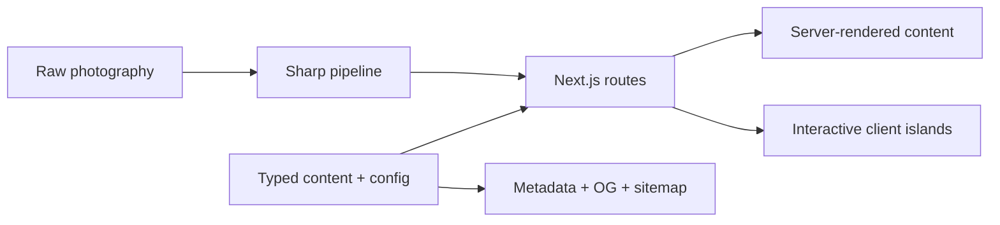

# Portfolio v2

```text
┌──────────────────────────────────────────────────────┐
│  DESIGN  ×  ENGINEERING  ×  MOTION  ×  STORYTELLING │
└──────────────────────────────────────────────────────┘
```

[Nicholas Lee's portfolio](https://nicholaslee.dev) is a working example of how I approach agentic AI engineering—from reliable LLM workflows and typed content to interaction details, performance, and tooling.

> I wanted the portfolio itself to be part of the interview: not only a place that describes my work, but a small product that demonstrates how I build.

## How I would explain it in an interview

I built the site with **Next.js 16 App Router, React 19, TypeScript, and Tailwind CSS v4**. Content-heavy route shells and metadata render on the server, while focused client components handle state, animation, browser APIs, and WebGL.

The portfolio is data-driven rather than a collection of hard-coded pages. Typed configuration controls project cards, ordering, case studies, static routes, metadata, and navigation. I then layer in native View Transitions, GSAP, Three.js experiments, a custom photography pipeline, and smaller details such as persistent themes and the interactive pixel pet.



## Technical deep dives

| Area | What it covers |
| --- | --- |
| [Architecture](docs/architecture/README.md) | App Router boundaries, typed content, static routes, SEO, and coding practices |
| [Interaction engineering](docs/interactions/README.md) | View Transitions, GSAP, Lenis, themes, WebGL, and the pixel character system |
| [Photography pipeline](docs/photography/README.md) | Source auditing, Sharp processing, safe manifests, responsive delivery, and panoramas |

## Engineering principles

```text
single source of truth  ──► derive routes, UI, navigation, and metadata
progressive enhancement ─► keep the experience usable without motion or WebGL
server/client boundaries ─► send client JavaScript only where interaction needs it
accessible interaction  ─► keyboard paths, focus handling, semantics, reduced motion
verification            ──► strict types, focused tests, zero-warning lint, builds
```

## Stack at a glance

| Area | Technologies |
| --- | --- |
| Framework | Next.js 16, React 19, TypeScript |
| Styling | Tailwind CSS v4, semantic CSS variables, `next/font` |
| Motion | View Transitions API, GSAP, Lenis |
| Graphics | Three.js, WebGL, GLSL, SVG |
| UI | Base UI, cmdk, Lucide, shadcn |
| Images | Next.js Image, Sharp |
| Quality | Bun test, ESLint, TypeScript, Web Vitals |

## Repository map

```text
portfolio-v2/
├── app/             routes, layouts, metadata, and Open Graph images
├── components/      UI, transitions, demos, photography, and themes
├── lib/             typed content, shared config, SEO, and utilities
├── scripts/photos/  photography audit and processing pipeline
├── public/          media, generated photos, posters, and resume
└── docs/            focused technical walkthroughs
```

## Run locally

The project uses **Bun** for dependency management and local scripts.

```bash
bun install
bun run dev
```

Open [http://localhost:3000](http://localhost:3000).

| Command | Purpose |
| --- | --- |
| `bun run build` | Run lint and create a production build |
| `bun run lint` | Run ESLint with zero warnings allowed |
| `bun test` | Run the test suite |
| `bun run og:assets` | Generate shared Open Graph assets |
| `bun run photos:all -- --source /path/to/photos` | Run the complete photography pipeline |

---

## Automated Contribution #1
Timestamp: 2026-08-30T17:34:42.256937
UUID: 3813315d-052e-47b9-89cc-f3e45d2fe1be
---


---

## Automated Contribution #2
Timestamp: 2026-08-30T17:35:06.960600
UUID: 26c4a429-36b2-42ec-aed2-7ef58f057c07
---


---

## Automated Contribution #1
Timestamp: 2026-08-30T17:41:32.339769
UUID: 4a459c08-2c2f-406b-b242-684f07d13fd4
---


---

## Automated Contribution #2
Timestamp: 2026-08-30T17:41:56.933060
UUID: fa382fe4-92a4-460f-b039-aebe7a8622bc
---

